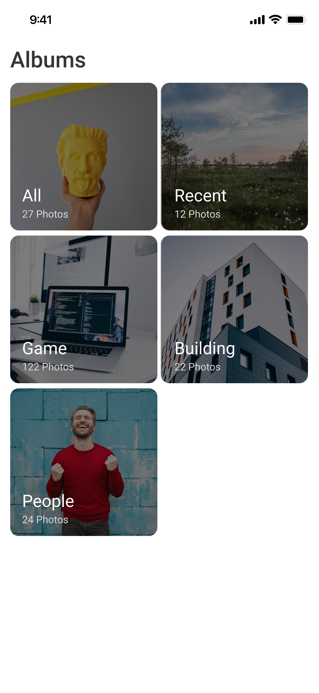

# Flutter Gallery App

A modern and feature-rich gallery application built with Flutter that displays albums and photos from the device's media storage. The app uses **BLoC** for state management, **GoRouter** for routing, **GetIt** and **Injectable** for dependency injection, and follows the **MVVM** architecture with **Clean Architecture** principles.

---

## Features

- **Albums View**:
  - Displays all albums stored on the device along with a thumbnail and the count of photos in each album.

- **Photo Viewer**:
  - Allows users to view photos inside an album in a grid-based design.

- **Native Image Fetching**:
  - Images and albums are retrieved **natively** using platform-specific APIs (`MediaStore` on Android and `Photos` framework on iOS) without relying on any third-party packages.

- **Dynamic Routing**:
  - Navigates between albums and photo views using `GoRouter`.

- **Clean Architecture**:
  - Separation of concerns with MVVM and domain, data, and presentation layers.

- **State Management**:
  - Implements reactive state handling with BLoC for a seamless user experience.

---

## Tech Stack

### Frameworks and Libraries
- **Flutter**: The framework for building the app.
- **BLoC**: For state management.
- **GoRouter**: For declarative navigation and deep linking.
- **GetIt & Injectable**: For dependency injection and service locator patterns.
- **MVVM Architecture**: Ensures separation of concerns and testability.
- **Native APIs for Image Fetching**:
  - **Android**: Images and albums are fetched using `MediaStore` APIs.
  - **iOS**: Images and albums are retrieved using the `Photos` framework.

---

## Native Image Fetching

This app does not use any third-party packages to retrieve images and albums. Instead, the implementation is done **natively** for both platforms:

### Android
- **`MediaStore` API** is used to query and fetch image data directly from the device storage.
- Albums and their corresponding images are retrieved using native database queries.

### iOS
- The **`Photos` framework** is used to fetch albums and images.
- File paths and metadata are retrieved directly from the device's photo library.

This native implementation ensures optimal performance, better control, and avoids dependencies on third-party packages for core functionality.

---

## Screenshots

### Albums View


### Photos Grid


---

## How It Works

1. **Albums View**:
   - The app fetches album data from the device using `MediaStore` (Android) and `Photos` framework (iOS).
   - The thumbnail and photo count are displayed for each album.

2. **Photo Viewer**:
   - When an album is selected, the app fetches and displays all photos within the album.

3. **Routing**:
   - Uses `GoRouter` for clean and scalable navigation between screens.

4. **State Management**:
   - BLoC handles album and photo fetching, ensuring a reactive and maintainable UI.

5. **Dependency Injection**:
   - Services like data repositories are injected using `GetIt` and `Injectable`, reducing coupling and increasing testability.

---

## Getting Started

### Prerequisites

- **Flutter SDK**: Ensure you have Flutter installed. [Download Flutter](https://flutter.dev/docs/get-started/install)
- **Android/iOS Device or Emulator**: To run the app on your device or simulator.

### Installation

1. **Clone the Repository**:
   ```bash
   git clone https://github.com/your_username/flutter_gallery.git
   cd flutter_gallery
   ```

2. **Install Dependencies**:
   ```bash
   flutter pub get
   ```

3. **Generate Dependency Injection Files**:
   ```bash
   flutter pub run build_runner build --delete-conflicting-outputs
   ```

4. **Run the App**:
   ```bash
   flutter run
   ```

---

## Contribution

Contributions are welcome! Follow these steps to contribute:

1. Fork the repository.
2. Create a feature branch:
   ```bash
   git checkout -b feature/your-feature-name
   ```
3. Commit changes:
   ```bash
   git commit -m "Add your feature description"
   ```
4. Push changes:
   ```bash
   git push origin feature/your-feature-name
   ```
5. Create a pull request.

---

## Contact

For any questions or support, please reach out to:

- **Your Name**: [shovocse753@gmail.com](mailto:your.email@example.com)
- **GitHub**: [hasibul-hasan-shuvo](https://github.com/your_username)

